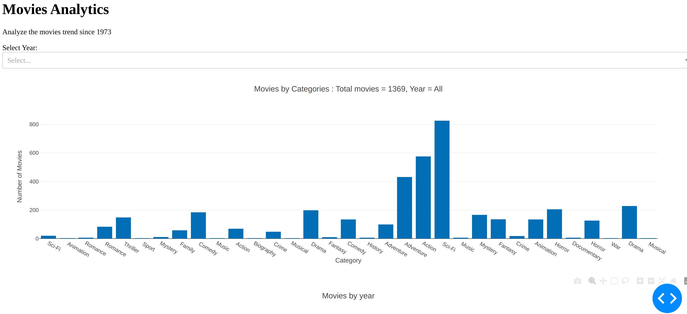
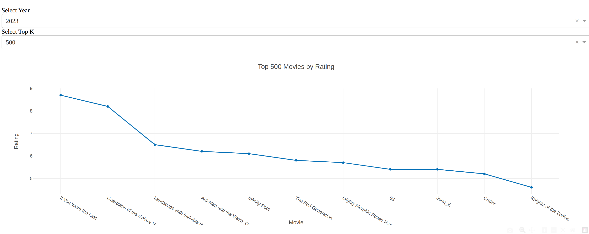

# Movie Analytics Dashboard

This project is a movie analytics dashboard that analyzes the behavior of movie genres and the number of movies in each category. It provides interactive visualizations using the Dash framework.

## Features

- Analyze the number of movies in different categories.
- Filter movies by year to explore the trends.
- Sort movies by IMDb rating to find the top-rated movies.
- Select the number of top movies to display.

## Requirements

- Numpy
- Python 3.x
- Pandas
- Plotly
- Dash

## Installation

1. Clone the repository:

2. Install the required requirements.txt:

## Usage

1. Navigate to the project directory:

2. Run the application:

3. Open your web browser and go to `http://localhost:8050` to access the dashboard.

4. Use the dropdown menu to select a year and explore the movie genres and their corresponding counts.

5. Sort the movies by IMDb rating to find the top-rated movies.

6. Adjust the number of top movies to display using the input field.

7. Enjoy exploring movie analytics!

## Contributing

Contributions are welcome! If you encounter any issues or have suggestions for improvement, please open an issue or submit a pull request.

## License

This project is licensed under the [MIT License](LICENSE).

## Results
The output results, Try out more figures for more Analysis.
Happy Coding!

